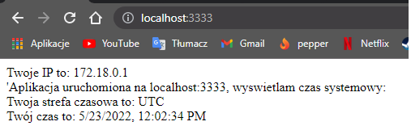
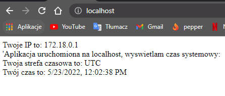

# Zadanie 1 - PFSWCHO
## Punkt 1.
W folderze node_server znajduje się plik server.js realizujący podpunkty z zadania 1.
Serwer nasłuchuje na porcie 3333.
Linie 13-28 umożliwiają wyświetlenie w przeglądarce informacji o adresie oraz czasie.
Linie 32,33 pozostawiają w logach informacje kto jest autorem serwera oraz na jakim porcie nasłuchuje serwer.

## Punkt 2.
Punkt 2 został zrealizowany na dwa sposoby - uruchomienie aplikacji bezpośrednio w kontenerze i zmapowanie portów (node_server/Dockerfile) lub wykorzystanie proxy nginx i skorzystanie z docker-compose. Powodem było przetestowanie, czy wewnątrz kontenera można odczytać prawdziwy adres IP klienta. W obu przypadkach się nie udało - aplikacja jest testowana lokalnie na 'localhoscie' a pokazywany czas to czas systemowy.
Użycie flagi --network=host również nie pomogło, gdyż funkcjonalność ta nie jest wspierana w Docker Desktop for Windows [Link do dokumentacji](https://docs.docker.com/network/host/)


## Punkt 3.
### Sposób 1
Aby zbudować obraz należy użyć polecenia: (będąc w folderze node_server)
`docker build . -t damianciechan/pfschwo_zadanie_1`
Następnie uruchomić kontener:
`docker run -p 3333:3333 -d --name node_server damianciechan/pfschwo_zadanie_1`
W konsoli wyświetlona zostanie wartość ID kontenera, np:
`80c5b5b8fd7be22959b70e664f3c7c03b56a20774094781c25ec6e6b27fd251d`.
Należy teraz użyć kilku pierwszych cyfr id i użyć polecenia:
`docker logs 80c5`
W wyniku tego polecenia zostanie wyświetlona wiadomość wygenerowania podczas uruchamiania serwera:
```
Kontener uruchomiony na porcie 3333
Autorem jest Damian Ciechan
```
Efekt działania pod adresem localhost:3333:

Ile warstw posiada obraz możemy sprawdzić poleceniem:
`docker history damianciechan/pfschwo_zadanie_1`
```
IMAGE          CREATED         CREATED BY                                      SIZE      COMMENT
788242f56ee4   3 minutes ago   LABEL org.opencontainers.image.authors=damia…   0B        buildkit.dockerfile.v0
<missing>      3 minutes ago   CMD ["node" "server.js"]                        0B        buildkit.dockerfile.v0
<missing>      3 minutes ago   EXPOSE map[3333/tcp:{}]                         0B        buildkit.dockerfile.v0
<missing>      3 minutes ago   COPY . . # buildkit                             2.67MB    buildkit.dockerfile.v0
<missing>      20 hours ago    RUN /bin/sh -c npm install # buildkit           2.7MB     buildkit.dockerfile.v0
<missing>      20 hours ago    COPY package*.json ./ # buildkit                44.4kB    buildkit.dockerfile.v0
<missing>      20 hours ago    RUN /bin/sh -c apk add --update nodejs npm #…   50.9MB    buildkit.dockerfile.v0
<missing>      20 hours ago    WORKDIR /usr/src/app                            0B        buildkit.dockerfile.v0
<missing>      23 hours ago    ADD alpine-minirootfs-3.15.4-aarch64.tar.gz …   5.32MB    buildkit.dockerfile.v0
```
### Sposób 2
Będąc w folderze głównym repozytorium:
`docker-compose up --build`
W logach zostanie automatycznie wyświetlona wiadomość o uruchomieniu serwera:
```
nodeserver_1  | Kontener uruchomiony na porcie 3333
nodeserver_1  | Autorem jest Damian Ciechan
```
Efekt działania pod adresem localhost jest taki sam, tzn:

## Punkt 4.
Zbudowanie obrazów oraz dodanie do repozytorium na DockerHub odbywa się poleceniem:
`docker buildx build -t damianciechan/pfschwo_zadanie_1 --platform linux/arm/v7,linux/arm64/v8,linux/amd64 --push .`
Efekt działania:
`docker buildx imagetools inspect damianciechan/pfschwo_zadanie_1`
```
Name:      docker.io/damianciechan/pfschwo_zadanie_1:latest
MediaType: application/vnd.docker.distribution.manifest.list.v2+json
Digest:    sha256:5a20997ae0e429bd12c05d239a4a22fbc828bb58f005746a69204eae43b02fde

Manifests:
  Name:      docker.io/damianciechan/pfschwo_zadanie_1:latest@sha256:9f5d9877e0af8fc5a0051eb7c2e5dd6c750f35849f6cff0778ac44b4aa937330
  MediaType: application/vnd.docker.distribution.manifest.v2+json
  Platform:  linux/arm/v7

  Name:      docker.io/damianciechan/pfschwo_zadanie_1:latest@sha256:c89a84f8ec194271c70f9e8047a60a582cbd3379236847dba7d06b0e456c7c86
  MediaType: application/vnd.docker.distribution.manifest.v2+json
  Platform:  linux/arm64

  Name:      docker.io/damianciechan/pfschwo_zadanie_1:latest@sha256:61ec31f28106b642c3e521eab8c98e0e153d6230e3bdcf829fa0ff5705edaeb7
  MediaType: application/vnd.docker.distribution.manifest.v2+json
  Platform:  linux/amd64
```
Link do repozytorium DockerHub: [damianciechan/pfschwo_zadanie_1](https://hub.docker.com/repository/docker/damianciechan/pfschwo_zadanie_1)